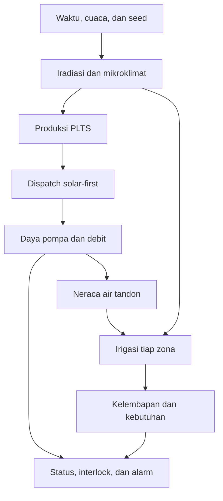

# PRINGGASURYA Physical Rules v1

Dokumen ini menjelaskan asal data yang tampil pada prototipe PRINGGASURYA. Model bersifat deterministik, menggunakan interval 15 menit, dan menghasilkan **data sintetis**, bukan pembacaan lapangan maupun hasil eksperimen.

## Tujuan

Model digunakan untuk:

1. memperagakan alur energi–air–tanaman pada antarmuka;
2. menguji respons kontrol dan interlock terhadap beberapa skenario;
3. membuat dataset konsisten untuk demonstrasi grafik dan analisis;
4. menyiapkan struktur yang kelak dapat dikalibrasi dengan data pilot.

Model belum digunakan untuk menentukan kapasitas final, memprediksi hasil panen, atau menyatakan kualitas air aman secara definitif.

## Resolusi dan reproduktibilitas

- Satu langkah model = 15 menit.
- Satu hari = 96 baris data.
- Random seed mengendalikan variasi kecil cuaca dan sensor.
- Input, skenario, dan seed yang sama menghasilkan dataset yang sama.
- Ekspor tersedia untuk 7 hari (672 baris), 30 hari (2.880 baris), dan 90 hari (8.640 baris).

## Rantai perhitungan

## Aturan inti

### Energi surya

Produksi sesaat dihitung dari kapasitas PLTS, iradiasi, dan efisiensi sistem:

\[
P_{PV}=P_{rated}\times\frac{G}{1000}\times0.82
\]

Nilai 0,82 mewakili rugi-rugi awal pada modul, inverter, kabel, temperatur, dan ketidakcocokan. Nilai ini harus dikalibrasi menggunakan data inverter pilot.

### Pompa dan hidraulik

Daya pompa skenario dipengaruhi luas layanan dan total dynamic head. Debit dihitung dari hubungan hidraulik:

\[
Q=\frac{P\eta}{\rho gH}
\]

Model memakai efisiensi hidraulik 58%, densitas air 1.000 kg/m³, dan percepatan gravitasi 9,81 m/s². Kurva pompa nyata harus menggantikan pendekatan ini setelah tipe pompa dipilih.

### Dispatch energi

1. PLTS melayani pompa terlebih dahulu.
2. PLN menutup kekurangan ketika irigasi aktif atau skenario grid-assist dipilih.
3. Jika PLN tidak tersedia dan daya surya tidak memenuhi ambang operasi, pompa berhenti.
4. Gangguan pompa memaksa daya, debit, dan tekanan menjadi nol.

### Neraca tandon

\[
V_{t+1}=V_t+Q_{in}\Delta t-Q_{out}\Delta t-L
\]

Volume dibatasi antara 0% dan 98% kapasitas. Model low-tank mengunci kondisi pada 19% untuk menguji alarm minimum.

### Kondisi tanaman

Tiga zona mewakili Padi, Hortikultura, dan Palawija. Kelembapan berubah karena:

- hujan efektif;
- kedalaman irigasi per luas zona;
- evapotranspirasi dan faktor tanaman;
- batas bawah/atas kelembapan model.

Kebutuhan irigasi dihitung dari defisit terhadap target tiap komoditas dan pengaturan kebutuhan global. Untuk padi, kelembapan internal diterjemahkan menjadi indikator muka air pada tampilan.

### Kualitas air

pH, EC, suhu, dan kekeruhan merupakan sinyal sintetis. Hujan meningkatkan kekeruhan. Nilai 50 NTU dipakai hanya sebagai batas interlock demonstrasi, bukan pernyataan baku mutu universal.

## Skenario

| Skenario | Perubahan utama | Respons yang diuji |
|---|---|---|
| Operasi normal | Cuaca dan perangkat normal | Keseimbangan sistem |
| Surya berkurang | Iradiasi diturunkan | Bantuan PLN |
| Tandon rendah | Level dikunci 19% | Alarm dan prioritas pengisian |
| Permintaan tinggi | Kebutuhan minimum dinaikkan | Prioritas zona |
| Debit abnormal | Pembacaan debit turun | Deteksi ketidaksesuaian daya–aliran |
| Sensor offline | Kualitas telemetry menurun | Larangan keputusan otomatis |
| Gangguan pompa | Pompa, debit, tekanan nol | Interlock kritis |

## Kolom dataset

Dataset CSV memuat waktu, skenario, cuaca, iradiasi, suhu, kelembapan udara, hujan, evapotranspirasi, daya PLTS, pompa dan PLN, solar fraction, level/volume tandon, debit, tekanan, pH, EC, kekeruhan, kelembapan dan kebutuhan tiga zona, zona aktif, serta status sistem.

## Jalur kalibrasi pilot

Sebelum digunakan untuk keputusan lapangan:

1. ganti profil cuaca sintetis dengan pengukuran atau data meteorologi terverifikasi;
2. masukkan kurva pompa dan efisiensi VFD aktual;
3. ukur kehilangan pipa, kapasitas tandon, dan debit sumber;
4. kalibrasi sensor kelembapan per jenis tanah;
5. tetapkan ambang kualitas air per komoditas dan hasil laboratorium;
6. bandingkan keluaran model dengan satu musim data pilot;
7. laporkan galat, sensitivitas, dan rentang ketidakpastian.
